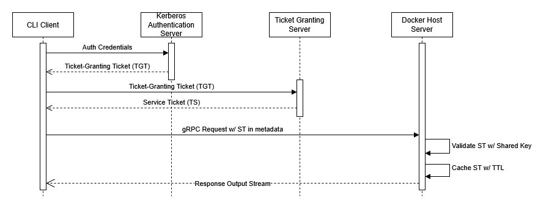
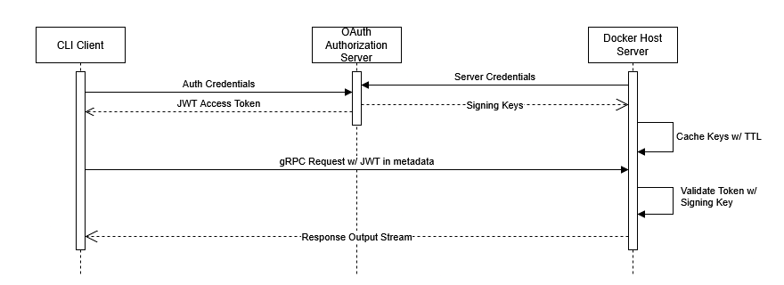
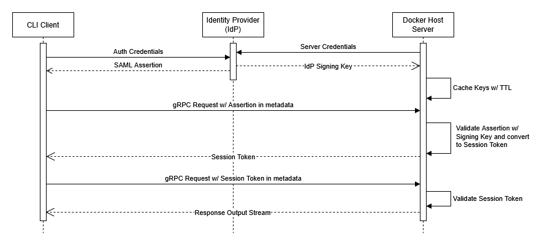

# Docker-SSH-Client

## Application Overview
Docker-SSH-Client is a lightweight command-line interface (CLI) for managing Docker containers over SSH. Built with [Bubble Tea](https://github.com/charmbracelet/bubbletea), it provides a streamlined way to execute commands, transfer files, and automate container operations on remote Docker hosts — all secured with gRPC-based authentication. It leverages the Docker API to perform operations such as transferring files between containers, executing ad-hoc commands or scripts (similar to Ansible) against multiple containers, and managing remote Docker clients using gRPC authentication.

<!-- ## Video Demo:
(tape file) -->

## Why Use It?
This tool is designed for DevOps engineers, system administrators, and developers who need an efficient way to manage containerized workloads remotely without direct access to the Docker CLI. It provides a secure gRPC-based interface for managing Docker containers remotely, with authentication supported through Kerberos, OAuth 2.0, or SAML. Once authenticated, the client can list running containers, push and pull files, and execute commands directly within containers, all while streaming output in real time for better visibility and faster debugging.

Docker-SSH-Client is built for secure and efficient remote execution. Its gRPC-based communication ensures that requests and responses are fast and secure, minimizing latency while maximizing performance. The tool is automation-friendly, allowing users to run scripts and commands programmatically across multiple containers. File transfers are fast and reliable, with real-time progress updates that make it easy to monitor the status of operations.

Designed with portability in mind, Docker-SSH-Client works seamlessly across Windows, macOS, and Linux, providing a consistent experience regardless of platform. Its lightweight design and minimal dependencies ensure quick setup and efficient operation, even in resource-constrained environments. Whether you need to automate container tasks or troubleshoot live issues, Docker-SSH-Client offers a robust and streamlined solution for managing remote Docker workloads.

## Installation/Deployment:

For the full steps follow the [Installation Guide](assets/Installation.md)

## Quickstart:

After following the installation steps, you can start using the Docker-SSH-Client by running the following commands:

... most common functionality...

```sh
docker-ssh-client list
```

For the full steps follow the [Usage Guide](assets/Usage.md)

## Implementation Details

The authentication process relies on an external authentication server that supplies certificates and tokens via gRPC. The client must authenticate using one of the supported mechanisms before performing operations on remote Docker instances.

### gRPC Authentication Flows
The system supports three authentication methods: **Kerberos, OAuth 2.0, and SAML**. Each method follows a different flow:

### **Kerberos Authentication Flow**


**(Used for enterprise environments with Active Directory)**
1. The client requests a **Ticket-Granting Ticket (TGT)** from the Kerberos Authentication Server (AS).
2. Using the TGT, the client requests a **Service Ticket (ST)** from the Ticket Granting Server (TGS).
3. The ST is attached as an **authentication token** in the gRPC request.
4. The server validates the ST against the Kerberos Key Distribution Center (KDC).
5. If valid, the request is processed.

### **OAuth 2.0 Authentication Flow**


**(Used for API-based authentication via Identity Providers like Google, Okta, etc.)**
1. The client authenticates with an **OAuth Authorization Server** (e.g., Google, Auth0).
2. It receives an **Access Token (JWT)**.
3. The token is sent in the gRPC request as metadata.
4. The server verifies the token’s **signature and expiration**.
5. If valid, the request is authorized.

### **SAML Authentication Flow**


**(Used for Single Sign-On (SSO) in enterprise applications)**
1. The client authenticates with an **Identity Provider (IdP)**.
2. The IdP generates a **SAML Assertion**.
3. The client sends the assertion in the gRPC request.
4. The server validates the assertion against the IdP.
5. If valid, the request is processed.

## Future Improvements
### Role-based access control (RBAC)
Currently, the authentication system ensures that only authenticated users can execute commands and manage Docker containers. However, implementing RBAC would allow for finer-grained control over permissions based on user roles. For example, an "admin" role could have full access to start, stop, and modify containers, while a "viewer" role might only have the ability to list running containers and view logs. This would improve security and operational control, particularly in multi-user environments where different users require different levels of access.

RBAC could be implemented using gRPC interceptors to check user roles before processing requests. Role definitions and permissions could be stored in an external identity provider (e.g., Active Directory or Auth0) and validated at runtime, ensuring centralized and consistent access management.

### Multi-user authentication
Currently, the tool supports single-user authentication per session. Adding multi-user authentication would allow multiple authenticated sessions to be managed concurrently. This would enable scenarios where multiple DevOps engineers or developers are working on the same set of Docker containers simultaneously without interfering with each other's operations.

Session isolation would need to be enforced at the gRPC level to ensure that users cannot access each other’s sessions or data. Introducing token-based session management with expiration policies would help maintain security and prevent unauthorized access.

### Secure Communication
While gRPC itself supports encrypted communication over HTTP/2, adding TLS (Transport Layer Security) at the connection level would further enhance security by encrypting all data in transit. Certificates from a trusted Certificate Authority (CA) like Let's Encrypt could be used to validate the identity of the server and secure client-server communication.

Implementing mutual TLS (mTLS) would allow both the client and server to authenticate each other, ensuring that only trusted clients can connect to the service. This would be especially beneficial for production environments where network security is a high priority.

### Extended Authentication Support
Adding OpenID Connect (OIDC) support would improve compatibility with modern authentication providers like Google, Microsoft, and Okta. OIDC builds on top of OAuth 2.0 and allows the use of ID tokens, which can carry more detailed information about the authenticated user, such as email, roles, and permissions.

### Extended Container Management
Add support for starting/stopping containers remotely.

Currently, the client can list and execute commands within running containers. Adding support for starting, stopping, and restarting containers remotely would make the tool more versatile for day-to-day container management.

### Caching Mechanisms
Introducing caching for frequently accessed operations, such as listing running containers or fetching container logs, could improve performance and reduce latency. A local in-memory cache (e.g., using Redis or Go’s built-in cache) could store data for a configurable period, reducing the need to query the Docker API for each request.

### Monitoring and Logging
Integrating with tools like Prometheus and Grafana would allow for real-time monitoring of system performance, request rates, and error counts. Setting up alerting rules based on these metrics would help detect and resolve issues proactively. Logs could be aggregated and indexed using the ELK stack (Elasticsearch, Logstash, and Kibana) for easy searching and analysis.